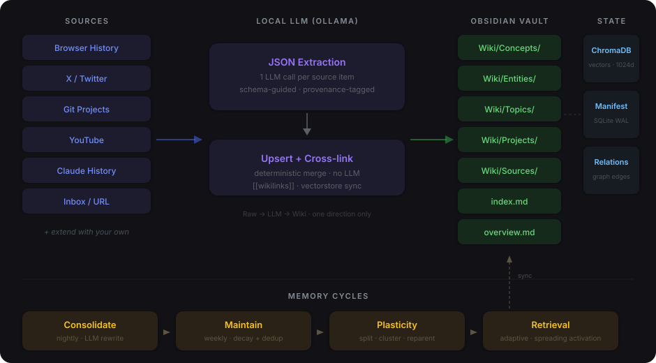
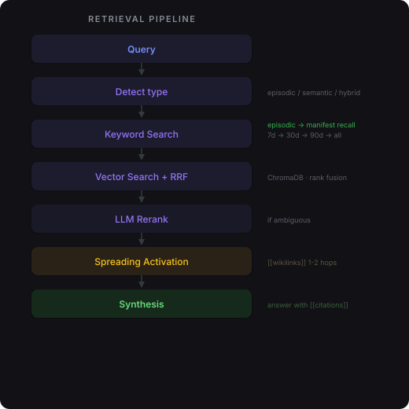
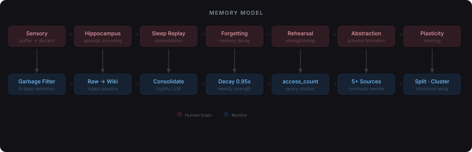

# Muninn — Design

A local LLM-powered knowledge base. Obsidian is the viewer, Ollama runs the LLM.

## Overview

```
Raw/Sources/           immutable snapshots of what you consumed
Wiki/                  LLM-generated pages with [[wikilinks]]
Journal/                 your own notes, ingested automatically
.agents/skills/        rules that govern how the LLM writes pages
```

Sources flow one direction: **Raw → LLM → Wiki**. The LLM reads raw but never writes it.



## 1. Sources and ingestion

### Connector contract

Every source is defined in `wiki.yaml`:

```yaml
- name: edge-history
  type: browser_history
  url: "file:///path/to/History"
  secret_env: null
  tool: muninn.sources.browser_history:BrowserHistorySource
  options: { ... }
```

`tool:` is a Python dotted path (`module:Class`). Adding a new source = one Python file + one YAML entry. `Inbox/` and `Journal/` are built-in — auto-detected without configuration.

### Schema-guided extraction

Each source type carries a schema hint that primes the LLM:

| Source type | What the LLM prioritizes |
|---|---|
| `browser_history` | Main topic, key claims with evidence, named entities |
| `x` | Author claim, cited data, people/orgs |
| `folder` | Document type, key facts, dates, action items |

One LLM call per source item. Page creation and merging are deterministic Python.

### Delta tracking

`manifest.db` (SQLite, WAL mode) stores per-source:

- **Cursor** — timestamp of last successful pull (only fetch newer items)
- **Per-item status** — `pending | processed | failed | skipped`

Re-running `muninn ingest --all` only processes new or failed items.

## 2. Storage

### Vault pages

Every knowledge page (concept, person, org, topic, project) is a markdown file with YAML frontmatter:

```yaml
title: "NVIDIA"
kind: org
schema: "technology/semiconductors"
summary: "..."
tags: [technology, semiconductors, org]
strength: 1.0
access_count: 0
consolidation_count: 0
importance: medium
lifecycle: draft
provenance: { extracted: 0.8, inferred: 0.2, ambiguous: 0.0 }
sources: ["[[2026-01-15-url-karpathy-llm-wiki]]"]
created: "2026-01-15"
updated: "2026-03-05"
```

### Vector store

ChromaDB at `<vault>/.muninn/chroma/`:

- `mxbai-embed-large` via Ollama (1024-dim, local)
- Pre-computed on ingest, not at query time
- Content hashing — only re-embeds when summary changes
- `muninn vectorstore-sync` rebuilds from scratch

### Manifest

SQLite at `<vault>/.muninn/manifest.db`:

- Source cursors and item status
- Query log (question, cited pages, duration)
- Typed relationships between pages (split_into, abstracts)
- Content hashes for near-duplicate detection

## 3. Retrieval

Four modes, set via `settings.retrieval_mode`:

```
                keyword     hybrid      reranked    adaptive
Step 1: Keyword  always      always      always      auto
Step 2: Vector   —           mxbai       mxbai       auto
Step 3: RRF      —           merge       merge       auto
Step 4: Rerank   —           —           top-K       auto
Step 5: Spread   —           —           —           auto
Step 6: Synth    always      always      always      always
```

### Adaptive mode (default)

Escalates through tiers until enough context is found.



**Source-aware queries**: Episodic queries ("what have I been reading from browser history") detect the source type and filter manifest results accordingly.

**Follow-up detection**: Vague follow-ups ("tell me more", "what about their revenue?") are expanded using prior conversation context — extracting [[wikilinks]] and named entities to resolve references.

**Strength-weighted scoring**: Keyword scores are multiplied by `strength` — frequently accessed pages rise, neglected pages fade.

**Graceful degradation**: Missing `mxbai-embed-large` falls back to keyword-only. Failed rerank falls back to RRF order. Empty ChromaDB falls back to keyword.

## 4. Memory model



### How pages change over time

| Mechanism | What happens | When |
|---|---|---|
| Decay | strength × 0.95 | Weekly (`maintain`) |
| Strengthening | +0.2 on re-ingest, access_count++ on citation | Ingest / query |
| Consolidation | LLM rewrites page for clarity and coherence | Nightly (`consolidate`) |
| Abstraction | Pages with 5+ sources get a synthesis rewrite | Nightly (`consolidate`) |
| Dedup | Jaccard similarity + LLM-confirmed merge | Weekly (`maintain`) |
| Forgetting | Weak drafts with no access in 30 days → stale | Weekly (`maintain`) |

### Plasticity (structural reorganization)

During `maintain`, the wiki can restructure itself:

| Operation | Trigger | What happens |
|---|---|---|
| Split | > 2000 words, 4+ sections, consolidated once | Page becomes hub linking to focused sub-pages |
| Cluster | 3+ pages share > 40% outgoing wikilinks | LLM creates an abstract parent concept page |
| Reparent | Page kind doesn't match folder | File moved to correct location |

Relationships are recorded in the manifest. ChromaDB is synced after all operations.

### Provenance

Every claim extracted by the LLM is tagged:

- `^[extracted]` — directly stated in source
- `^[inferred]` — derived by the LLM
- `^[ambiguous]` — conflicting or uncertain

Consolidation promotes well-sourced claims and prunes noise.

## 5. Serve endpoint

```
Obsidian Copilot → POST /v1/chat/completions → muninn serve
                   (OpenAI-compatible)            → retrieval
                                                  → Ollama synthesis
                                                  → SSE stream back
```

| Endpoint | Purpose |
|---|---|
| `POST /v1/chat/completions` | OpenAI-compatible (Copilot, Cline, any client) |
| `GET /v1/models` | Returns the model `muninn` |
| `POST /query` | Native: `{answer, citations[], question}` |
| `GET /health` | Liveness check |

Binds to `127.0.0.1:19828`. Token-protected via `MUNINN_API_TOKEN` in `.env` (optional).

## 6. Configuration

### Models

| Operation | Default | Alternatives |
|---|---|---|
| Ingest | `gemma4:e4b` | `granite4.1:8b`, `qwen3:8b` |
| Query | `gemma4:e4b` | `qwen3:14b`, `qwen3:8b` |
| Embeddings | `mxbai-embed-large` | — |

Configured in `wiki.yaml`. Fallback chain: `ollama_model_ingest → ollama_model`, `ollama_model_query → ollama_model`.

### Ollama tuning (Apple Silicon)

```bash
export OLLAMA_FLASH_ATTENTION=1
export OLLAMA_KEEP_ALIVE=-1
export OLLAMA_MLX=1
export OLLAMA_NUM_PARALLEL=2
export OLLAMA_ORIGINS="app://obsidian.md*"
```

## 7. Security

- **SSRF protection** — `tool:` paths restricted to `muninn.sources.*`
- **Atomic writes** — write to temp, then rename
- **Timing-safe auth** — `MUNINN_API_TOKEN` verification
- **Localhost only** — serve binds to `127.0.0.1` by default
- **Secrets isolation** — values in `.env` only, `wiki.yaml` uses `secret_env:` indirection

## 8. File layout

```
muninn/
  cli.py                      typer CLI
  config.py                   wiki.yaml + .env → pydantic
  pipeline.py                 ingest orchestrator
  ollama.py                   httpx client for Ollama
  vault.py                    markdown read/write with YAML frontmatter
  manifest.py                 SQLite delta tracker
  prompts.py                  loads SKILL.md as system prompts
  vectorstore.py              ChromaDB vector store
  provenance.py               claim-level provenance
  init_op.py                  interactive setup
  sources/
    base.py                   Source ABC + RawItem
    browser_history.py        Chrome/Edge/Arc SQLite reader
    x.py                      X API v2 + OAuth 1.0a
    folder.py                 recursive multi-format (PDF, DOCX, MD)
    url.py                    one-off URL fetch
    inbox.py                  vault Inbox/ watcher
    youtube.py                YouTube transcript extraction
    claude_history.py         Claude Code history
  ops/
    ingest.py                 CLI → pipeline wiring
    query.py                  retrieval + synthesis
    retrieval.py              adaptive retrieval cascade
    serve.py                  FastAPI OpenAI-compat endpoint
    lint.py                   health checks
    maintain.py               decay, dedup, plasticity, cross-link, vectorstore sync
    consolidate.py            LLM rewrite, vectorstore sync
```
